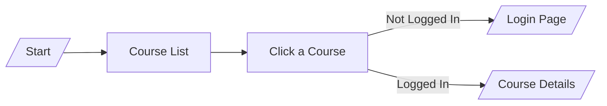

When asked to diagram something:
1. Ask what kind of diagram fits best — a flowchart for a process, or a simple
   architecture diagram for how parts of an app connect.
2. Write valid Mermaid syntax inside a ```mermaid code block.
3. Keep it simple — no more than 8-10 boxes. A diagram nobody can read isn't useful.
4. Add a one-sentence plain-language caption above the diagram.
5. Save the result into the project's README.md, under a "## How It Works" heading.


For example:
"The app starts at `/` and shows a list of courses. Users can click on a course,
which opens `/course/{id}`. If the user isn't logged in, they're redirected to `/login`."

Result in README.md:

## How It Works

A simple diagram showing the course-viewing flow:

