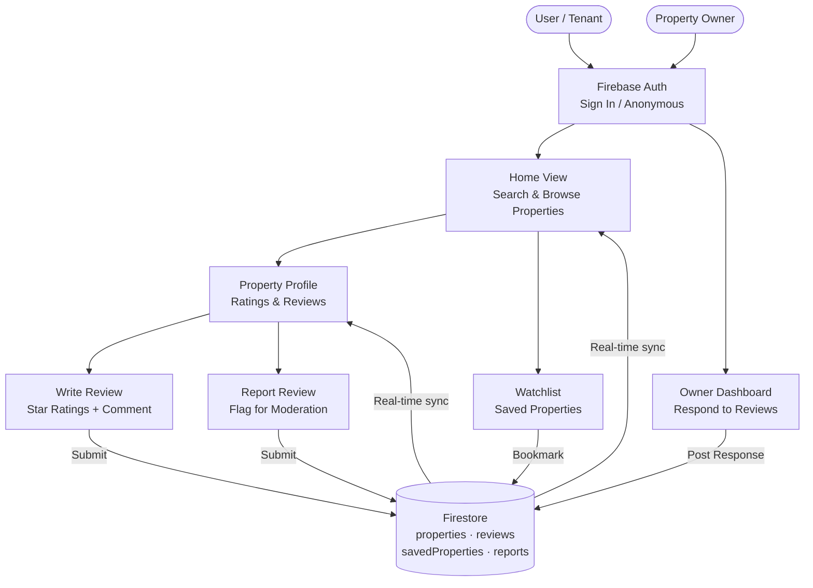

# RealtorReview

> The most trusted platform for tenant-led property insights in India. Credible. Anonymous. Community-driven.

A React + Firebase web application where tenants can search, review, and bookmark rental properties — and landlords can respond to feedback on their listings.

## Tech Stack

- **Frontend**: React 19, TypeScript, Vite, TailwindCSS
- **Backend / Database**: Firebase Firestore (real-time), Firebase Auth
- **AI**: Google Genai SDK
- **Animations**: Motion (Framer Motion)

## How It Works

Users can browse properties, sign in, write verified reviews, and save properties to a watchlist. Owners can respond to reviews from their dashboard. Users can also flag suspicious reviews via a report system.



## Project Structure

```
src/
├── App.tsx                     # Root component — routing & Firestore subscriptions
├── types.ts                    # Shared TypeScript types
├── lib/
│   ├── firebase.ts             # Firebase init & helpers
│   └── sampleData.ts           # Seed data for initial properties & reviews
├── context/
│   └── AuthContext.tsx         # Firebase Auth context provider
└── components/
    ├── Navbar.tsx              # Top navigation bar
    ├── HomeView.tsx            # Property search & listing grid
    ├── PropertyProfileView.tsx # Property detail page with reviews
    ├── WriteReviewView.tsx     # Full-page review form
    ├── WatchlistView.tsx       # Saved / bookmarked properties
    ├── OwnerDashboardView.tsx  # Owner response interface
    ├── ProfileSettingsView.tsx # User profile & activity
    ├── AuthModal.tsx           # Sign-in / sign-up modal
    ├── WriteReviewModal.tsx    # Quick review modal
    ├── ReviewGuidelinesModal.tsx  # Guidelines acceptance modal
    └── ReportReviewModal.tsx   # Flag / report a review modal
```

## Getting Started

```bash
# Install dependencies
bun install   # or npm install

# Set up environment variables
cp .env.example .env
# Fill in your Firebase project config in .env

# Start the dev server
npm run dev   # runs on http://localhost:3000
```

## Firestore Collections

| Collection | Description |
|---|---|
| `properties` | Rental property listings with ratings |
| `reviews` | Tenant reviews with sub-ratings |
| `savedProperties` | User watchlist / bookmarks |
| `reports` | Flagged reviews awaiting moderation |
| `users` | User profile documents |
